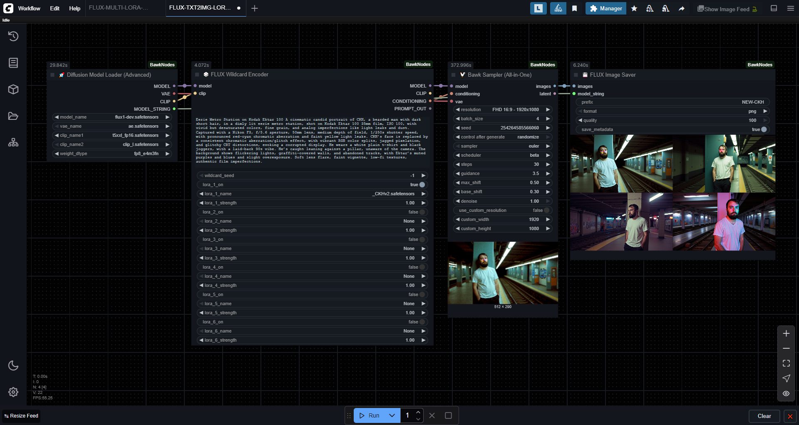

<div align="center">
<h1>🐓 ComfyUI Bawk Nodes v2.0.0</h1>

**A collection of FLUX-optimized ComfyUI nodes for efficient AI image generation.**

</div>



---

## 🎯 **What's New in v2.0.0**

**Major Rewrite**: Complete FLUX-first redesign with modular architecture and workflow consolidation.

- 🎲 **Enhanced Wildcard Encoder** with 6 LoRA slots
- 🐓 **All-in-One BawkSampler** with integrated VAE decoding
- 📁 **Modular Architecture** for better maintainability
- ⚡ **Streamlined Workflows** - fewer nodes, more power
- 💾 **Enhanced Image Saver** with prompt saving

---

## 🚀 **Node Collection Overview**

| Node | Description | Category |
|------|-------------|----------|
| 🚀 **Diffusion Model Loader** | Advanced FLUX-optimized model loading | Loaders |
| 🎲 **FLUX Wildcard Encoder** | Text encoding + 6 LoRA slots + wildcards | Conditioning |
| 🐓 **Bawk Sampler** | All-in-one latent generation, sampling & VAE decode | Sampling |
| 💾 **FLUX Image Saver** | Organized saving with metadata & prompt files | Image |
| 📝 **FLUX Prompt Saver** | Standalone prompt archiving | Text |

---

## 🔥 **Complete FLUX Workflow**

**Before BawkNodes (5+ nodes):**
```
CheckpointLoader → LoraLoader → CLIPTextEncode → EmptyLatent → KSampler → VAEDecode → SaveImage
```

**After BawkNodes (3 nodes):**
```
🚀 DiffusionModelLoader → 🎲 FluxWildcardEncode → 🐓 BawkSampler → 💾 FluxImageSaver
```

**60% fewer nodes, 100% of the power!**

---

## 📦 **Installation**

### Method 1: ComfyUI Manager (Recommended)
1. Open ComfyUI Manager
2. Search for "Bawk Nodes"
3. Click Install
4. Restart ComfyUI

### Method 2: Manual Installation
```bash
cd ComfyUI/custom_nodes
git clone https://github.com/juddisjudd/ComfyUI-BawkNodes.git
# Restart ComfyUI
```

---

## 🎲 **Node Details**

### 🚀 **Diffusion Model Loader (Advanced)**

**FLUX-optimized model loading with advanced features.**

**Features:**
- Multiple model formats (FLUX, SDXL, SD1.5)
- Flexible weight data types (fp8, fp16, bf16, fp32)
- Separate VAE and CLIP loading
- Multiple directory support

**Inputs:**
- `model_name` - Model from diffusion_models folder
- `vae_name` - VAE or "baked VAE"
- `clip_name1/2` - CLIP models for FLUX
- `weight_dtype` - Precision optimization

**Outputs:** `MODEL`, `VAE`, `CLIP`, `MODEL_STRING`

---

### 🎲 **FLUX Wildcard Encoder**

**Enhanced text encoder with 6 LoRA slots and wildcard support.**

**Features:**
- **Wildcard Processing**: `{option1|option2|option3}` syntax
- **6 LoRA Slots**: Individual enable/disable toggles
- **Fuzzy LoRA Matching**: Flexible file resolution
- **FLUX Optimization**: 16-channel conditioning

**Inputs:**
- `model`, `clip` - From model loader
- `prompt` - Text with wildcard support
- `wildcard_seed` - Seed for consistent wildcard selection
- `lora_X_on` - Enable/disable each LoRA (X = 1-6)
- `lora_X_name` - LoRA selection dropdown
- `lora_X_strength` - Strength adjustment (-10.0 to +10.0)

**Outputs:** `MODEL`, `CLIP`, `CONDITIONING`, `PROMPT_OUT`

**Example Prompt with Wildcards:**
```
A {beautiful|stunning|gorgeous} {cat|dog|bird} in a {forest|garden|meadow}, 
{photorealistic|artistic|stylized} style
```

---

### 🐓 **Bawk Sampler (All-in-One)**

**Complete latent generation, sampling, and VAE decoding in one node.**

**Features:**
- **Smart Resolution Presets**: Pre-configured FLUX-optimized resolutions
- **Custom Resolution Support**: Manual width/height with 64px alignment
- **Advanced FLUX Sampling**: All FLUX-specific parameters
- **Integrated VAE Decoding**: Direct image output
- **Batch Generation**: Up to 64 images at once

**Key Inputs:**
- `model`, `conditioning`, `vae` - From previous nodes
- `resolution` - Smart presets or custom
- `batch_size` - Number of images (default: 4)
- `sampler` - Sampling method (default: euler)
- `scheduler` - Noise schedule (default: beta)
- `steps` - Sampling steps (default: 30)
- `guidance` - FLUX guidance scale (default: 3.5)
- `max_shift` - FLUX max shift (default: 0.5)
- `base_shift` - FLUX base shift (default: 0.3)

**Resolution Presets:**
- `FHD 16:9 - 1920x1080` (default)
- `Medium Square - 1024x1024`
- `Portrait 9:16 - 1080x1920`
- `Ultra-wide - 1792x768`
- And many more...

**Outputs:** `IMAGE`, `LATENT`

---

### 💾 **FLUX Image Saver**

**Organized image saving with metadata and prompt archiving.**

**Features:**
- **Smart Folder Organization**: `[MODEL]-DD-MM-YYYY` structure
- **Multiple Formats**: PNG, JPG, WebP support
- **Metadata Embedding**: PNG metadata support
- **Prompt File Saving**: Separate `.txt` files with processed prompts
- **JSON Metadata**: Complete generation parameters

**Inputs:**
- `images` - From BawkSampler
- `model_string` - From model loader
- `processed_prompt` - From wildcard encoder
- `save_prompt` - Enable prompt file saving (default: True)
- `format` - Image format (PNG/JPG/WebP)
- `quality` - Compression quality (1-100)

**File Output Example:**
```
ComfyUI/output/[FLUX_Model]-01-08-2025/
├── flux_image_01-08-2025_14-30-15_001.png
├── flux_image_01-08-2025_14-30-15_002.png
├── flux_image_01-08-2025_14-30-15_prompt.txt
├── flux_image_01-08-2025_14-30-15_001_metadata.json
└── flux_image_01-08-2025_14-30-15_002_metadata.json
```

---

### 📝 **FLUX Prompt Saver**

**Standalone prompt and parameter archiving.**

**Features:**
- **JSON Format**: Structured data storage
- **Complete Parameters**: All generation settings
- **Organized Storage**: Matches image saver folder structure
- **Workflow Integration**: Links with other BawkNodes

---

## 🛠️ **Advanced Usage**

### **Wildcard Examples**

**Basic Wildcards:**
```
A {red|blue|green} car in the {city|countryside}
```

**Nested Concepts:**
```
{A majestic|An elegant|A powerful} {dragon|phoenix|griffin} 
{soaring through|perched upon|emerging from} {clouds|mountains|flames}
```

**Style Variations:**
```
Portrait of a woman, {photorealistic|oil painting|digital art|watercolor} style,
{studio lighting|natural lighting|dramatic lighting}
```

### **LoRA Management**

**Best Practices:**
1. **Enable LoRAs individually** for precise control
2. **Use strength between 0.5-1.5** for most LoRAs
3. **Combine complementary LoRAs** (style + subject)
4. **Test different combinations** for unique results

**Example LoRA Setup:**
- LoRA 1: `realistic_skin_v2.safetensors` (0.8)
- LoRA 2: `dramatic_lighting.safetensors` (0.6)
- LoRA 3: `detail_enhancer.safetensors` (0.4)

### **Resolution Guidelines**

**Recommended Presets:**
- **Square**: `Medium Square - 1024x1024`
- **Landscape**: `FHD 16:9 - 1920x1080`
- **Portrait**: `Portrait 9:16 - 1080x1920`
- **Widescreen**: `Ultra-wide - 1792x768`

**Custom Resolution Rules:**
- Must be multiples of 64 pixels
- Keep total pixel count reasonable (<4MP for speed)
- Consider VRAM limitations for large batches

---

## 🔧 **Configuration**

### **Model Setup**

1. **FLUX Models**: Place in `models/diffusion_models/`
2. **VAE Files**: Place in `models/vae/`
3. **CLIP Models**: Place in `models/text_encoders/`
4. **LoRA Files**: Place in `models/loras/`

### **Recommended Settings**

**For Speed:**
- Resolution: `Medium Square - 1024x1024`
- Batch Size: `4`
- Steps: `20-25`
- Sampler: `euler`

**For Quality:**
- Resolution: `FHD 16:9 - 1920x1080`
- Batch Size: `1-2`
- Steps: `30-40`
- Sampler: `dpmpp_2m`

**For Experimentation:**
- Use wildcards with high variation
- Enable multiple LoRAs
- Try different guidance scales (2.0-5.0)

---

## **Troubleshooting**

### **Common Issues**

**Node Not Appearing:**
```bash
# Check ComfyUI console for errors
# Ensure all files are in correct directories
# Restart ComfyUI completely
```

**LoRA Not Loading:**
- Check file is in `models/loras/`
- Verify file isn't corrupted
- Check console for specific error messages

**Memory Issues:**
- Reduce batch size
- Use lower resolution
- Enable `fp8` weight dtype in loader

**Generation Errors:**
- Verify all connections are correct
- Check that VAE is connected to BawkSampler
- Ensure CLIP and MODEL are from same loader

### **Performance Optimization**

**VRAM Usage:**
- Use `fp8_e4m3fn_fast` for weight dtype
- Reduce batch size for large images
- Close other GPU applications

**Speed Improvements:**
- Use `euler` sampler with `beta` scheduler
- Reduce step count (20-30 is often sufficient)
- Use medium resolution presets

---

## 📄 **License**

GPL-3.0 license - see [LICENSE](LICENSE) file for details.

---

## 🙏 **Acknowledgments**
- **[rgthree](https://github.com/rgthree/rgthree-comfy)** - Inspiration for dynamic UI patterns

---

## 🔗 **Links**

- **Comfy Registry**: [Comfy-Registry](https://registry.comfy.org/publishers/judd/nodes/comfyui-bawknodes)
- **Issues**: [Report Bugs](https://github.com/juddisjudd/ComfyUI-BawkNodes/issues)

---

[](https://ko-fi.com/P5P57KRR9)